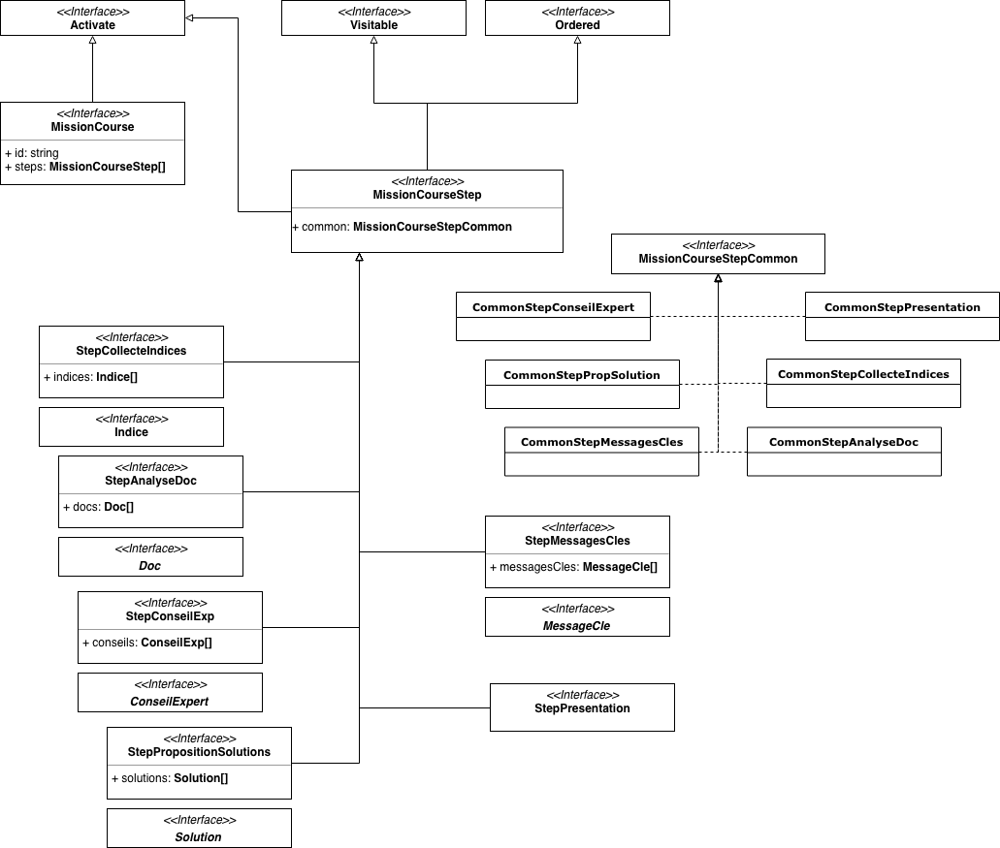

# Structure des données

La structure de données d'une mission est décrite par un ensemble d'interfaces
situées dans le package `src/app/@common/models/`.

## Diagramme de classes


> Pour plus de détail, consulter le site<a href="../tsdoc/index.html"> TSDoc<a>

## Exemple de structure de Mission

````javascript
export const Mission1: MissionCourse = {
  id: 'm1',
  intro: false,
  name: 'Zoom sur le mix énergétique',
  level: undefined,
  description: 'Zoom sur le mix énergétique',
  mandatory: true,
  activ: true,
  steps: [
    {
      index: 1,
      common: CommonStepPresentation.instance(),
      bgName: 'bg1.png',
      visited: false,
      activ: false,
      presTitle: 'Bienvenue dans la mission',
      presText: 'Kenny...',
      presImage: 'kenny.svg'
    },
    {
      index: 2,
      common: CommonStepCollecteIndices.instance(),
      bgName: 'bg2.png',
      visited: false,
      activ: false,
      indices: [
        {
          x: 1077.76,
          y: 696.51,
          visited: false,
          title: 'Les émissions du secteur de l‘industrie',
          image: 'indice4.png',
          pdf: 'string',
          text: 'Depuis...'
        }
      ]
    },
    {
      index: 3,
      common: CommonStepCollecteIndices.instance(),
      bgName: 'bg3.png',
      visited: false,
      activ: false,
      indices: [
        {
          x: 805.76,
          y: 174.51,
          visited: false,
          title: 'Production et énergies renouvelables',
          video: 'q1bPxwiP75k'
        }
      ]
    },
    {
      index: 4,
      common: CommonStepAnalyseDoc.instance(),
      bgName: 'bg3.png',
      visited: false,
      activ: false,
      docs: [
        {
          docTitle: 'Smart city',
          docFile: 'doc1.pdf',
          docExtension: 'application/pdf'
        }
      ]
    },
    {
      index: 5,
      common: CommonStepConseilExpert.instance(),
      bgName: 'bg3.png',
      visited: false,
      activ: false,
      conseils: [
        {
          name: 'Camille',
          job: 'Technicienne exploitation',
          image: 'exp_camille.png',
          advice: 'Je veille...',
          goodToKnow: 'La production...'
        }
      ]
    },
    {
      index: 6,
      common: CommonStepPropSolution.instance(),
      bgName: 'bg3.png',
      visited: false,
      activ: false,
      solutions: [
        {
          title: 'Repenser le système économique local',
          solution: 'Vous pensez...',
          goodToKnow: 'Pour mettre...',
          bg: 'bg3.png',
          bgX: '-631px',
          bgY: '-34px',
          expert_img: 'exp_camille.png',
          visited: false,
          selected: false,
        }
      ]
    },
    {
      index: 7,
      common: CommonStepMessagesCles.instance(),
      bgName: 'bg3.png',
      visited: false,
      activ: false,
      messagesCles: [
        {
          message : 'Les transports...',
          wimg: 'Intro_primaire_ecran1_.png',
          wx: '-394px',
          wy: '-124px',
          visited : false
        }
      ]
    }
  ]
};
````


