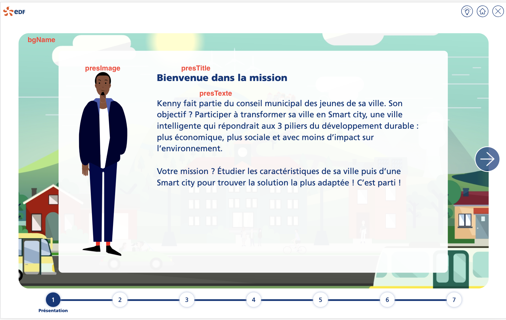

# Tutorial 2 : étape de présentation

Compléter les données de la mission avec les informations de l'étape de présentation :

````typescript
steps: [
  {
    index: 1,
    common: CommonStepPresentation.instance(),
    bgName: 'bg1.png',
    visited: false,
    activ: false,
    presTitle: 'Bienvenue dans la mission',
    presText: 'Kenny fait ...',
    presImage: 'kenny.svg'
  },
  // other data
]
````

Ci-dessous la correspondance des données avec l'IHM



<a style="float: right;" href="tuto3-step-collindice.md">Aller à l'étape suivante > </a>
