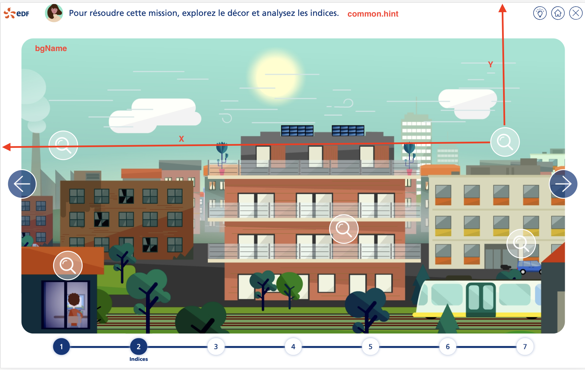
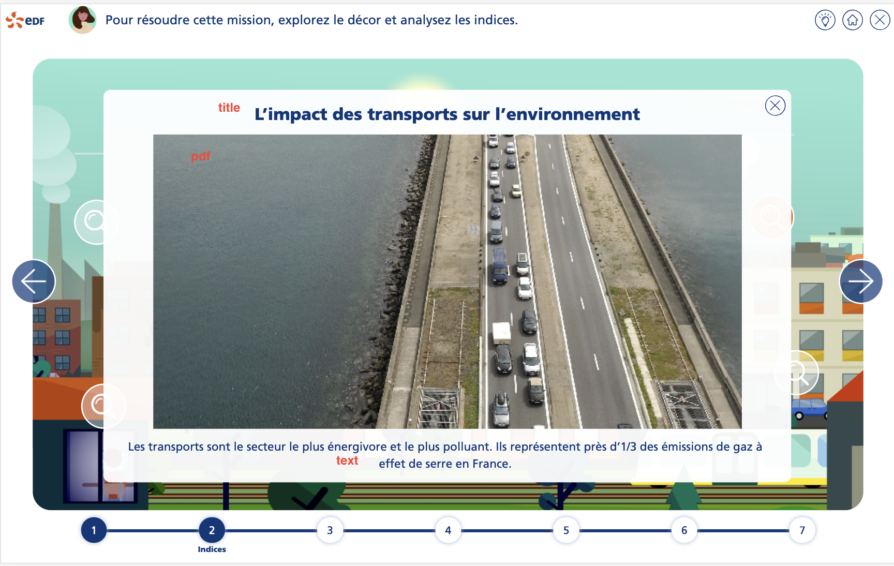

# Tutorial 3 : étape de collecte d'indices

Compléter les données de la mission avec les informations de l'étape de collecte d'indices :

````typescript
steps: [
  // data
      index: 2,
      common: CommonStepCollecteIndices.instance(),
      bgName: 'bg2.png',
      visited: false,
      activ: false,
      indices: [
        {
          x: 1077.76,
          y: 696.51,
          visited: false,
          title: 'Les émissions...',
          image: 'indice4.png',
          pdf: 'string',
          text: 'Depuis 1990...'
        },
        //
    ]
  // other data
]
````

Ci-dessous la correspondance des données avec l'IHM




<a style="float: right;" href="tuto4-analyse-doc.md">Aller à l'étape suivante > </a>
