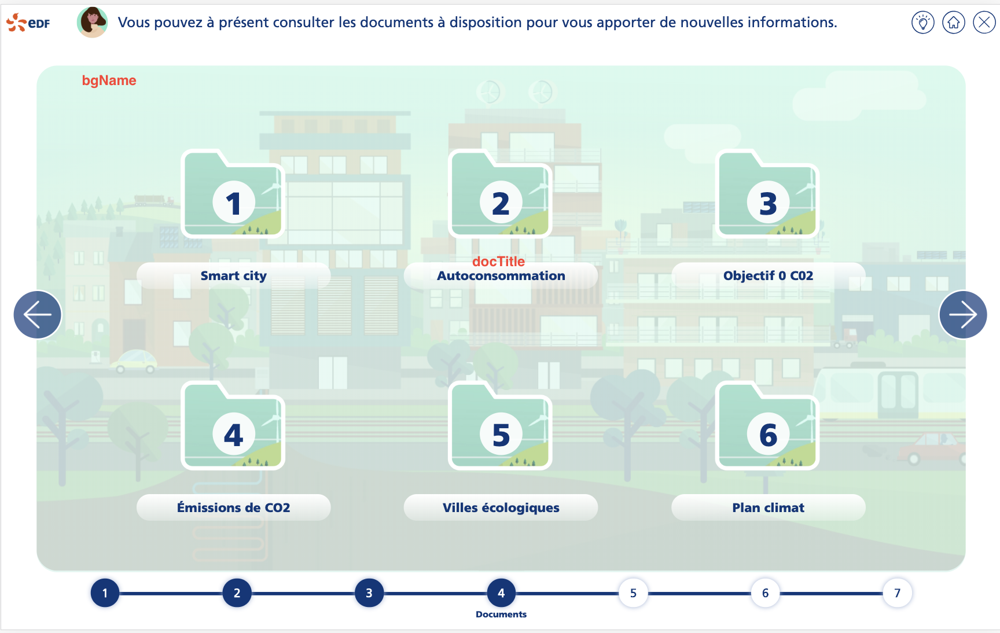
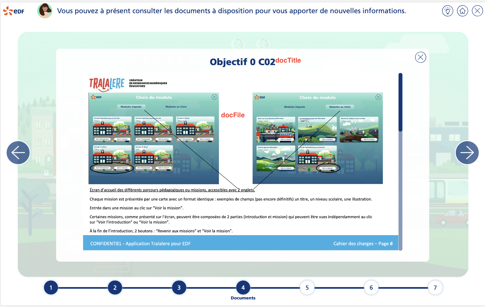

# Tutorial 4 : étape d'analyse de documentation

Compléter les données de la mission avec les informations de l'étape d'analyse de document :

````typescript
steps: [
  // data
    {
      index: 4,
      common: CommonStepAnalyseDoc.instance(),
      bgName: 'bg3.png',
      visited: false,
      activ: false,
      docs: [
        {
          docTitle: 'Smart city',
          docFile: 'doc1.pdf',
          docExtension: 'application/pdf'
        },
        //
    ]
  // other data
]
````

Ci-dessous la correspondance des données avec l'IHM




<a style="float: right;" href="tuto5-step-consexp.md">Aller à l'étape suivante > </a>
