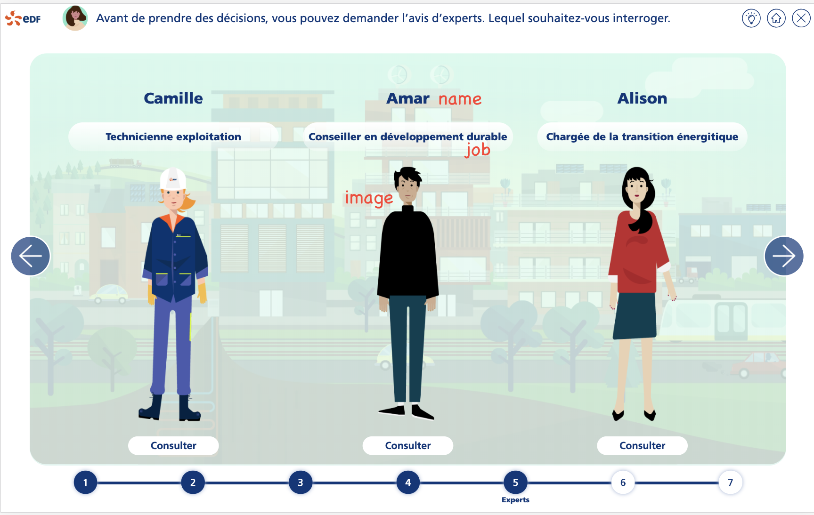
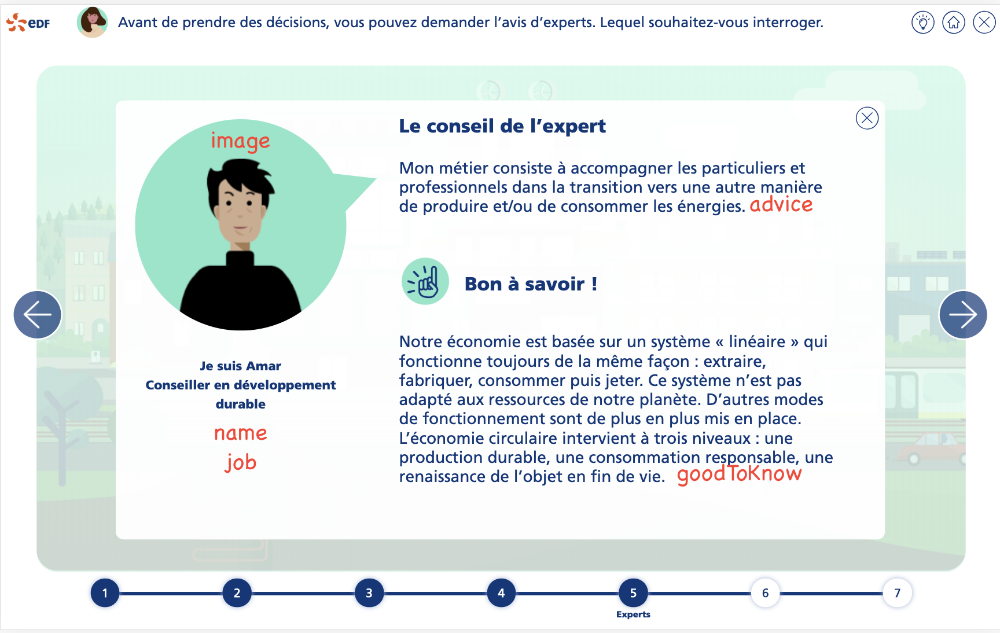

# Tutorial 5 : étape de conseils d'expert

Compléter les données de la mission avec les informations de l'étape de conseils d'expert :

````typescript
steps: [
  // data
    {
      index: 5,
      common: CommonStepConseilExpert.instance(),
      bgName: 'bg3.png',
      visited: false,
      activ: false,
      conseils: [
        {
          name: 'Camille',
          job: 'Technicienne exploitation',
          image: 'exp_camille.png',
          advice: 'Je veille...',
          goodToKnow: 'La production...'
        },
        //
    ]
  // other data
]
````

Ci-dessous la correspondance des données avec l'IHM




<a style="float: right;" href="tuto6-step-propsolutions.md">Aller à l'étape suivante > </a>
