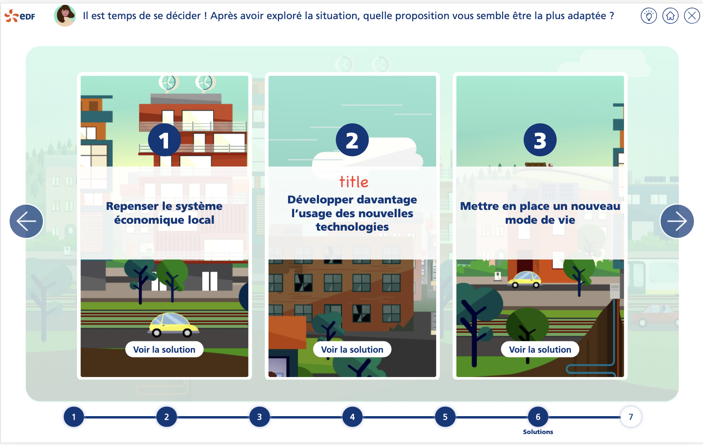
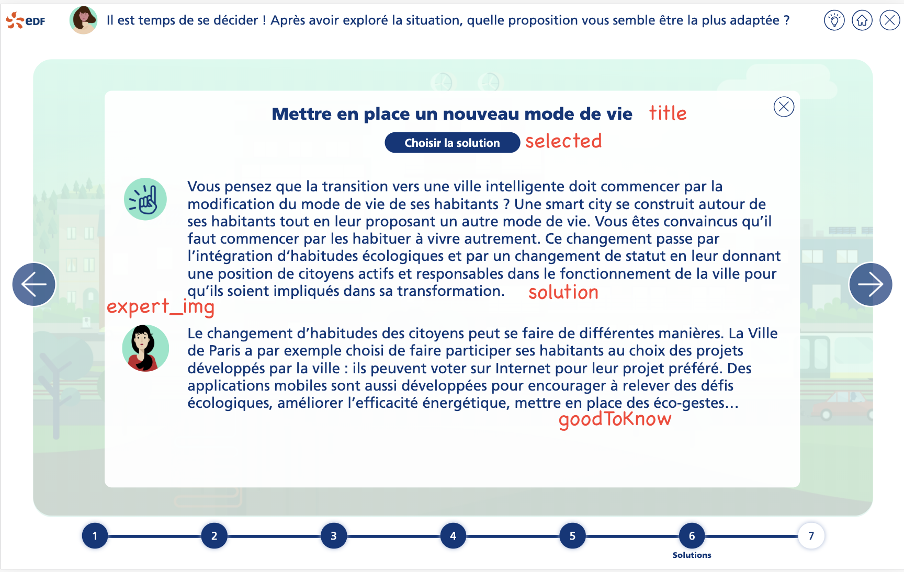

# Tutorial 6 : étape de proposition de solutions

Compléter les données de la mission avec les informations de l'étape de proposition de solution :

````typescript
steps: [
  // data
    {
      index: 6,
      common: CommonStepPropSolution.instance(),
      bgName: 'bg3.png',
      visited: false,
      activ: false,
      solutions: [
        {
          title: 'Repenser le système économique local',
          solution: 'Vous pensez...',
          goodToKnow: 'Pour mettre...',
          bg: 'bg3.png',
          bgX: '-631px',
          bgY: '-34px',
          expert_img: 'exp_camille.png',
          visited: false,
          selected: false,
        },
        //
    ]
  // other data
]
````

Ci-dessous la correspondance des données avec l'IHM




<a style="float: right;" href="tuto7-step-msgcles.md">Aller à l'étape suivante > </a>
