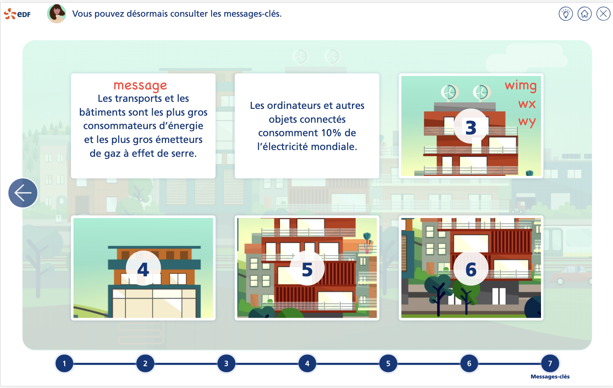

# Tutorial 7 : étape de messages clés

Compléter les données de la mission avec les informations de l'étape de messages clées :

````typescript
steps: [
  // data
    {
      index: 7,
      common: CommonStepMessagesCles.instance(),
      bgName: 'bg3.png',
      visited: false,
      activ: false,
      messagesCles: [
        {
          message : 'Les transports...',
          wimg: 'Intro_primaire_ecran1_.png',
          wx: '-394px',
          wy: '-124px',
          visited : false
        },
        //
    ]
  // other data
]
````

Ci-dessous la correspondance des données avec l'IHM


